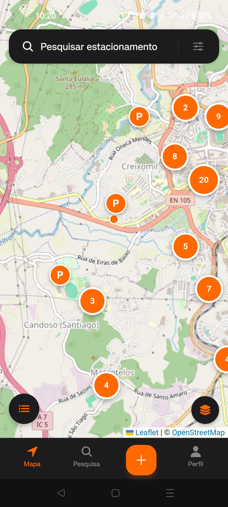
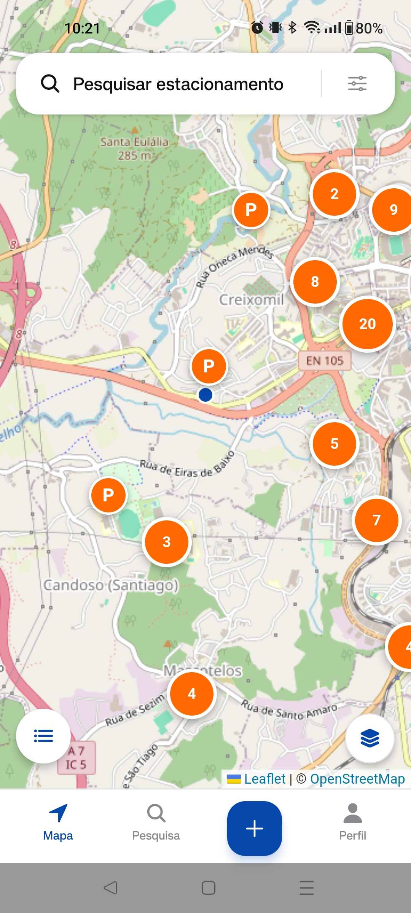
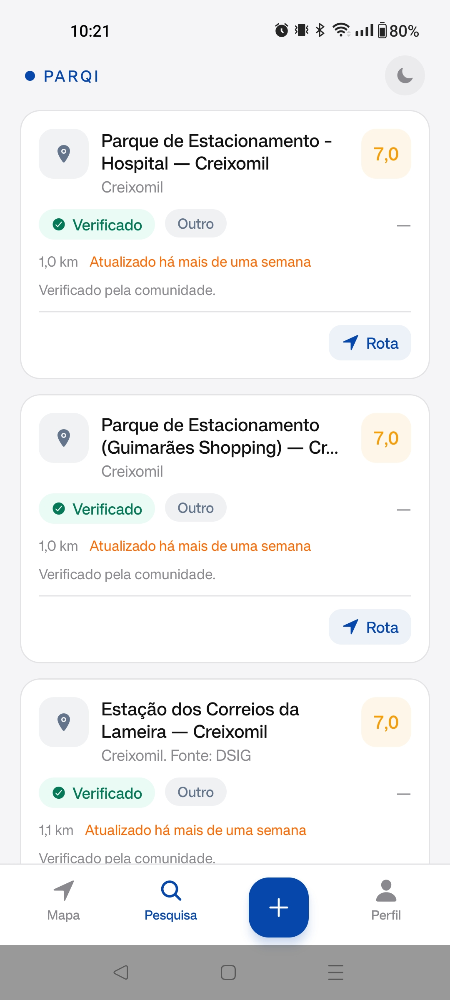
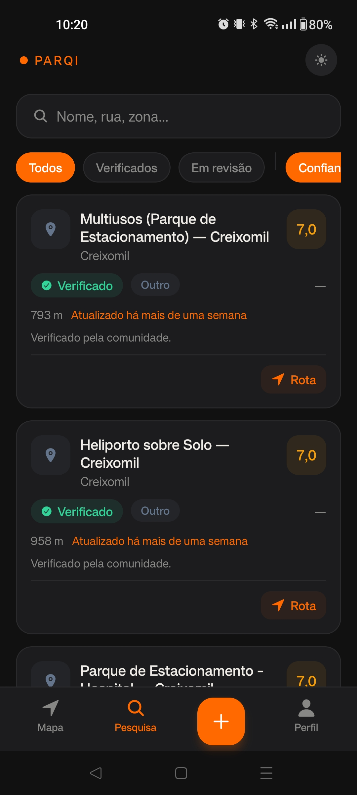

<div align="center">


# Parqi

**Encontra estacionamento em Portugal, sem dar voltas.**

App comunitária que junta dados públicos das câmaras municipais, OpenStreetMap e Geoapify com contribuições da comunidade — com uma pontuação de confiança por lugar e rota direta no Google Maps.

[](https://github.com/TFSG28/parqi/actions/workflows/deploy.yml)
[](LICENSE)


</div>

---

## Screenshots

<div align="center">
  <table>
    <tr>
      <td align="center" width="24%">
        <br />
        <sub><b>Mapa</b> — tema escuro</sub>
      </td>
      <td align="center" width="24%">
        <br />
        <sub><b>Mapa</b> — tema claro</sub>
      </td>
      <td align="center" width="24%">
        <br />
        <sub><b>Pesquisa</b> — com confiança</sub>
      </td>
      <td align="center" width="24%">
        <br />
        <sub><b>Pesquisa</b> — tema escuro</sub>
      </td>
    </tr>
  </table>
</div>

## Como funciona

| | |
|---|---|
| **P — Dados abertos, já no mapa** | Os parques das câmaras municipais e do OpenStreetMap entram no Parqi para todos os concelhos de Portugal. |
| **+ — A comunidade acrescenta o resto** | Qualquer condutor pode adicionar um lugar: nome, tipo, lotação e a posição exata, num ponto ou numa área desenhada no mapa. |
| **✓ — Confiança que se vê** | Cada lugar mostra uma pontuação de confiança (0–10) alimentada por confirmações da comunidade: **+1,5** por confirmação, **−2** por reporte. A partir de **5** o lugar fica **Verificado**; abaixo de **3** entra em revisão. |

## Stack

| Parte | Tecnologias |
|---|---|
| **mobile/** — a app (Expo) | React Native, Expo Router, React Native Maps (OSM via Leaflet WebView / Google / Mapbox), tema claro/escuro |
| **frontend/** — parqi.pt (montra) | Next.js 16, React 19, Tailwind CSS 4, TypeScript |
| **backend/** — API | Node.js, Express 5, Prisma + PostgreSQL (PostGIS), Zod, Clean Architecture |

## Estrutura

```
parqi/
├── mobile/       # App (Expo) — o produto
├── frontend/     # parqi.pt — montra informativa
├── backend/      # API REST (Express + Prisma + PostGIS)
└── docs/         # Mockups HTML + screenshots gerados
```

## Run it

### Backend

```bash
cd backend
npm install
cp .env.example .env   # configurar DATABASE_URL, JWT_SECRET, etc.
npm run db-update      # PostGIS + migrações + índices geográficos
npm run dev            # http://localhost:3001
```

### Frontend (parqi.pt)

```bash
cd frontend
npm install
cp .env.example .env.development   # NEXT_PUBLIC_API_URL
npm run dev                        # http://localhost:3000
```

### Mobile (Expo)

```bash
cd mobile
npm install
npx expo start
```

> Variáveis de ambiente do mobile: `EXPO_PUBLIC_API_URL`, `EXPO_PUBLIC_MAP_PROVIDER` (`osm` \| `google` \| `mapbox`), `EXPO_PUBLIC_GOOGLE_MAPS_API_KEY`. Ver [SETUP.md](SETUP.md) para a lista completa.

## Testes & qualidade

```bash
cd backend  && npm run build         # vitest + eslint + tsc
cd frontend && npm run build         # vitest + next build
cd mobile   && npx tsc --noEmit && npx jest
```

O CI corre lint · testes · build nas três partes em cada push/PR ([deploy.yml](.github/workflows/deploy.yml)).

## Screenshots

Os ecrãs vêm da app real (pasta [`docs/app/`](docs/app)). O banner do topo e as molduras do site são gerados a partir deles:

- Banner do README ([docs/banner.html](docs/banner.html)) — molduras de telemóvel sobre o azul da marca.
- Site ([frontend/src/app/page.tsx](frontend/src/app/page.tsx)) — componente `PhoneFrame` com as mesmas imagens.

Para regenerar o banner após atualizar `docs/app/`:

```bash
CHROME="/c/Program Files/Google/Chrome/Application/chrome.exe"
OUT=$(cygpath -m "$PWD")
"$CHROME" --headless=new --disable-gpu --window-size=1300,880 \
  --force-device-scale-factor=2 --hide-scrollbars --virtual-time-budget=6000 \
  --screenshot="$OUT/docs/screenshots/hero.png" "file:///$OUT/docs/banner.html"
```

## Licença

[ISC](LICENSE) © Parqi
